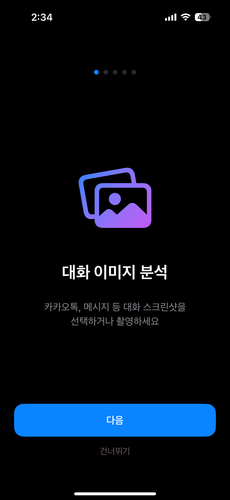
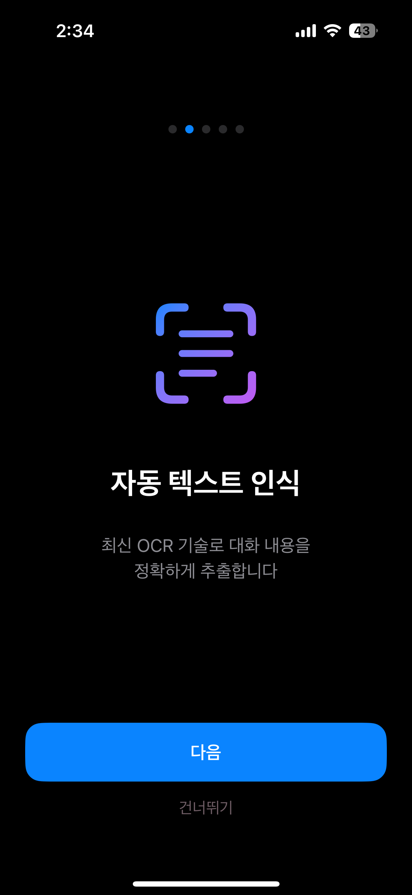
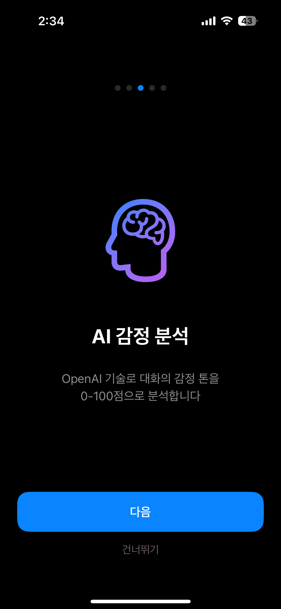
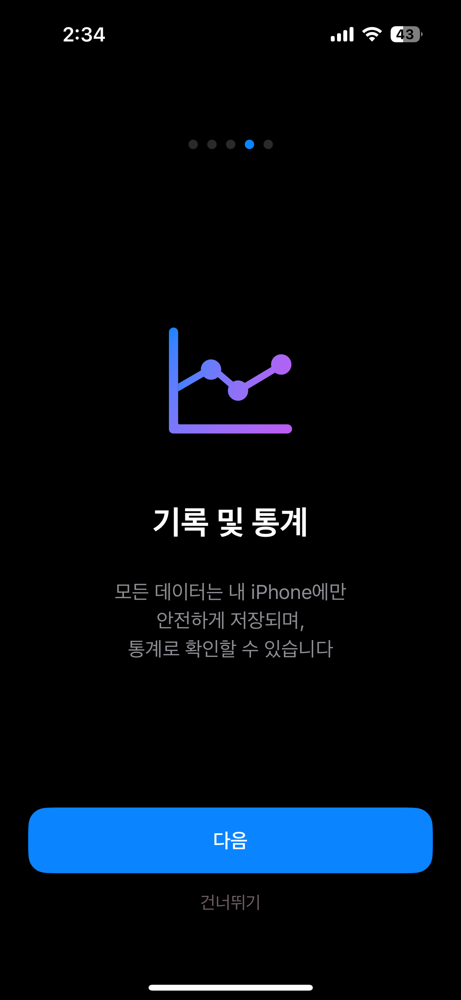
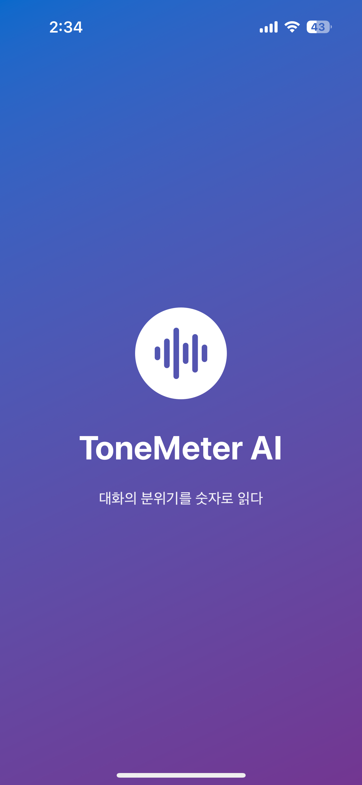
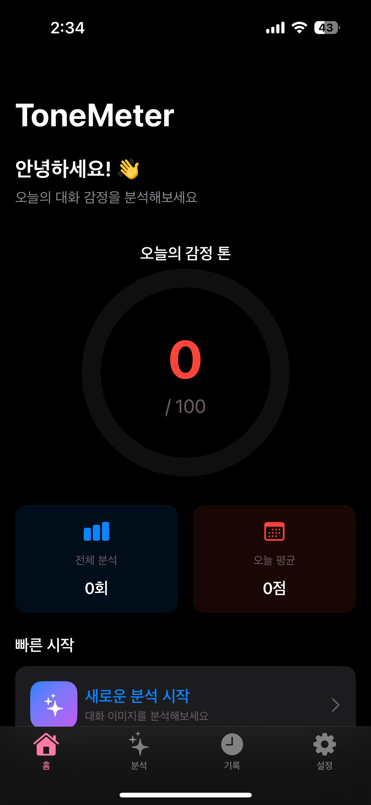
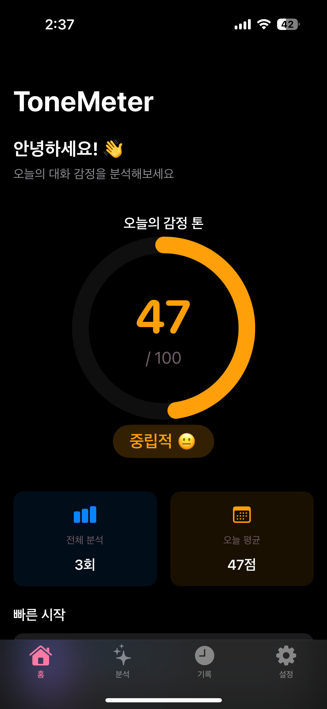
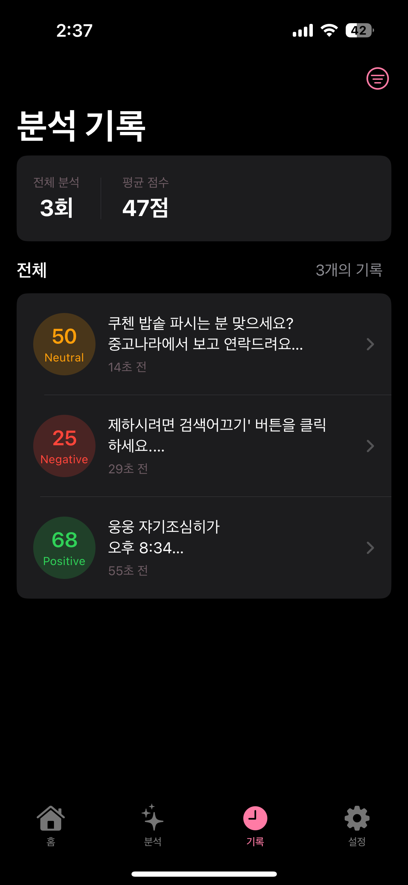
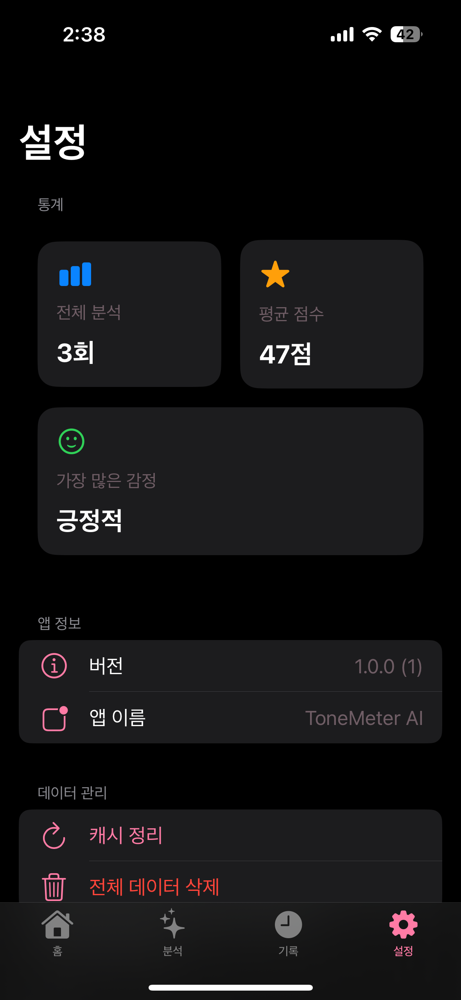

# 🎭 ToneMeter

> **대화의 감정 톤을 AI로 분석하는 iOS 앱**  
> Apple Vision Framework OCR + OpenAI GPT-4o-mini + SwiftUI

[](https://www.apple.com/ios/)
[](https://swift.org)
[](https://developer.apple.com/xcode/swiftui/)

**ToneMeter**는 대화 스크린샷을 분석하여 감정 톤을 **0~100 점수**로 시각화하는 iOS 개인 프로젝트입니다.  
**Vision Framework**로 텍스트를 추출하고, **OpenAI GPT-4o-mini**로 감정을 분석하여, 직관적인 미터기 UI로 결과를 제공합니다.

### 🎯 프로젝트 목표
- Vision Framework OCR과 AI 분석을 결합한 실용적인 감정 분석 앱 구현
- MVVM 아키텍처 기반의 확장 가능한 iOS 앱 설계
- SwiftUI와 GRDB를 활용한 모던 iOS 개발 경험 쌓기

---

## 📑 목차

- [📱 프리뷰](#-프리뷰)
- [✨ 주요 기능](#-주요-기능)
- [🏗️ 기술 스택](#️-기술-스택)
- [📁 프로젝트 구조](#-프로젝트-구조)
- [🚀 설치 및 빌드 방법](#-설치-및-빌드-방법)
- [📖 사용 방법](#-사용-방법)
- [🧪 테스트 & 문서](#-테스트--문서)
- [🎨 디자인 시스템](#-디자인-시스템)
- [💡 기술적 하이라이트](#-기술적-하이라이트)
- [📝 개발 회고](#-개발-회고)

---

## 📱 프리뷰

### 🎬 데모 영상

<div align="center">
  <video src="sample/ToneMeterAI.mp4"
         width="300"
         controls
         muted
         playsinline
         loop
         poster="sample/tonemeter_poster.png">
    <a href="sample/ToneMeterAI.mp4">Watch the demo video</a>
  </video>
</div>

### 📸 스크린샷

<div align="center">
  
#### 🚀 온보딩
   

#### 🏠 메인 화면
  

#### 📊 분석 & 설정
  

</div>

---

## ✨ 주요 기능

### 📸 이미지 기반 감정 분석
- **OCR 텍스트 인식**: Apple Vision Framework로 대화 이미지에서 텍스트 추출 (정확도 ~89%)
- **AI 감정 분석**: OpenAI GPT-4o-mini로 감정 톤 분석 (0~100 점수)
- **실시간 결과**: 이미지 선택부터 결과 표시까지 평균 2.6초

### 🎨 아름다운 UI/UX
- **감정 미터기**: 점수에 따른 그라데이션 게이지 (긍정/중립/부정)
- **감정 카드**: 분석 결과를 시각적으로 표시
- **다크 모드**: 자동 지원

### 📊 기록 관리
- **분석 히스토리**: 모든 분석 기록을 로컬 DB에 저장 (GRDB)
- **필터링 & 정렬**: 날짜별, 감정별, 점수별 필터링
- **상세 보기**: OCR 원문, 감정 키워드, 분석 근거 확인

### 🛠️ 설정
- **통계**: 전체 분석 수, 평균 점수, 가장 많은 감정
- **데이터 관리**: 캐시 정리, 전체 데이터 삭제
- **지원**: 문의하기, 개인정보 처리방침, 오픈소스 라이선스

---

## 🏗️ 기술 스택

| 분야 | 기술 |
|------|------|
| **플랫폼** | iOS 16.0+ |
| **언어** | Swift 5.9+ |
| **UI** | SwiftUI |
| **아키텍처** | MVVM (Model-View-ViewModel) |
| **OCR** | Vision Framework (`VNRecognizeTextRequest`) |
| **AI 분석** | OpenAI API (`gpt-4o-mini`) |
| **로컬 DB** | GRDB.swift |
| **Analytics** | Firebase Analytics |
| **Crash Report** | Firebase Crashlytics |
| **의존성 관리** | Swift Package Manager (SPM) |

---

## 📁 프로젝트 구조

```
ToneMeter/
├── App/
│   ├── ToneMeterApp.swift          # 앱 진입점
│   └── AppDelegate.swift           # Firebase 초기화
├── Models/
│   ├── EmotionRecord.swift         # 감정 기록 모델 (GRDB)
│   ├── ToneAnalysisResult.swift    # AI 분석 결과 모델
│   ├── ChatCompletionRequest.swift # OpenAI 요청 모델
│   └── ChatCompletionResponse.swift# OpenAI 응답 모델
├── Services/
│   ├── Database/
│   │   ├── DatabaseManager.swift   # GRDB 초기화 & 마이그레이션
│   │   └── EmotionRecordRepository.swift # CRUD 메서드
│   ├── OCR/
│   │   └── VisionOCRService.swift  # Vision Framework OCR
│   └── API/
│       ├── OpenAIService.swift     # OpenAI API 클라이언트
│       └── APIConfiguration.swift  # API 키 관리
├── ViewModels/
│   ├── HomeViewModel.swift         # 홈 화면 ViewModel
│   ├── AnalysisViewModel.swift     # 분석 화면 ViewModel
│   ├── HistoryViewModel.swift      # 히스토리 ViewModel
│   └── SettingsViewModel.swift     # 설정 ViewModel
├── Views/
│   ├── Launch/
│   │   ├── LaunchView.swift        # 스플래시 화면
│   │   └── OnboardingView.swift    # 온보딩 화면
│   ├── Main/
│   │   ├── ToneMeterTabView.swift  # 탭 바 (Home/History/Settings)
│   │   └── HomeView.swift          # 메인 홈 화면
│   ├── Analysis/
│   │   └── AnalysisView.swift      # 분석 진행 화면
│   ├── History/
│   │   ├── HistoryView.swift       # 기록 리스트
│   │   └── DetailView.swift        # 상세 보기
│   ├── Settings/
│   │   ├── SettingsView.swift      # 설정 화면
│   │   └── LicensesView.swift      # 라이선스 화면
│   └── Components/
│       ├── ToneMeterGauge.swift    # 미터기 컴포넌트
│       ├── EmotionCard.swift       # 감정 카드
│       ├── EmotionChart.swift      # 감정 차트
│       ├── ImagePicker.swift       # 이미지 선택기
│       └── ...
├── Utilities/
│   ├── Extensions/
│   │   ├── Color+Theme.swift       # 색상 테마
│   │   └── UIImage+.swift          # 이미지 유틸
│   ├── Enums/
│   │   ├── AnalysisStep.swift      # 분석 단계 Enum
│   │   ├── AnalysisError.swift     # 에러 타입
│   │   └── ...
│   ├── Constants.swift             # 앱 상수
│   ├── PermissionManager.swift     # 권한 관리
│   └── UserDefaultsKeys.swift      # UserDefaults 키
├── Resources/
│   ├── Assets.xcassets/            # 이미지 & 아이콘
│   └── Colors.xcassets/            # 색상 팔레트
├── Debug.xcconfig                  # Debug 빌드 설정 (API 키, Git 무시됨)
├── Release.xcconfig                # Release 빌드 설정 (API 키, Git 무시됨)
├── GoogleService-Info.plist        # Firebase 설정 (Git 무시됨)
└── Info.plist
```

---

## 🚀 설치 및 빌드 방법

### 📋 필수 요구사항

- **macOS**: 13.0 (Ventura) 이상
- **Xcode**: 15.0 이상
- **iOS 시뮬레이터 또는 실제 디바이스**: iOS 16.0+
- **OpenAI API 키**: [OpenAI Platform](https://platform.openai.com/)에서 발급
- **Firebase 프로젝트**: [Firebase Console](https://console.firebase.google.com/)에서 생성

### 📥 1. 프로젝트 클론

```bash
git clone https://github.com/YOUR_USERNAME/ToneMeter.git
cd ToneMeter
```

### 🔧 2. API 키 설정

프로젝트는 Debug와 Release 환경별로 설정 파일이 분리되어 있습니다. `ToneMeter/` 디렉토리에 각각 OpenAI API 키를 추가해야 합니다.

#### Debug.xcconfig 설정

```bash
# ToneMeter/Debug.xcconfig 생성
cat > ToneMeter/Debug.xcconfig << 'EOF'
// Configuration Settings File
DEBUG = true

// OpenAI API Key
OPENAI_API_KEY = sk-proj-xxxxxxxxxxxxxxxxxxxxxxxx
EOF
```

#### Release.xcconfig 설정

```bash
# ToneMeter/Release.xcconfig 생성
cat > ToneMeter/Release.xcconfig << 'EOF'
// Configuration Settings File
DEBUG = false

// OpenAI API Key
OPENAI_API_KEY = sk-proj-xxxxxxxxxxxxxxxxxxxxxxxx
EOF
```

또는 각 파일을 수동으로 생성:

```xcconfig
// ToneMeter/Debug.xcconfig
DEBUG = true
OPENAI_API_KEY = sk-proj-your_api_key_here
```

```xcconfig
// ToneMeter/Release.xcconfig
DEBUG = false
OPENAI_API_KEY = sk-proj-your_api_key_here
```

> 💡 **팁**: 개발 중에는 Debug 빌드가 사용되므로 `Debug.xcconfig`만 먼저 설정해도 됩니다.

### 🔥 3. Firebase 설정

1. [Firebase Console](https://console.firebase.google.com/)에서 새 프로젝트 생성
2. iOS 앱 추가 (Bundle ID: `com.yourname.ToneMeter`)
3. `GoogleService-Info.plist` 다운로드
4. 다운로드한 파일을 `ToneMeter/` 디렉토리에 복사

```bash
cp ~/Downloads/GoogleService-Info.plist ToneMeter/
```

5. Firebase Console에서 **Analytics**와 **Crashlytics** 활성화

### 📦 4. 의존성 설치

Xcode에서 프로젝트를 열면 Swift Package Manager가 자동으로 의존성을 다운로드합니다:

```bash
open ToneMeter.xcodeproj
```

**의존성 목록**:
- [GRDB.swift](https://github.com/groue/GRDB.swift) - SQLite ORM
- [Firebase iOS SDK](https://github.com/firebase/firebase-ios-sdk) - Analytics & Crashlytics

수동 설치가 필요한 경우:
1. Xcode 메뉴: **File > Packages > Resolve Package Versions**
2. 또는 **Product > Clean Build Folder** 후 다시 빌드

### ▶️ 5. 빌드 및 실행

#### Xcode에서 실행
1. Xcode에서 타겟 선택: **ToneMeter**
2. 시뮬레이터 또는 실제 디바이스 선택
3. `Cmd + R` 또는 ▶️ 버튼 클릭

#### 터미널에서 빌드
```bash
# Debug 빌드
xcodebuild -project ToneMeter.xcodeproj \
           -scheme ToneMeter \
           -configuration Debug \
           -destination 'platform=iOS Simulator,name=iPhone 15 Pro'

# Release 빌드
xcodebuild -project ToneMeter.xcodeproj \
           -scheme ToneMeter \
           -configuration Release \
           -destination 'platform=iOS Simulator,name=iPhone 15 Pro'
```

### ⚠️ 주의사항

- `Debug.xcconfig`, `Release.xcconfig`, `GoogleService-Info.plist`는 `.gitignore`에 포함되어 있습니다
- API 키를 절대 공개 저장소에 커밋하지 마세요
- OpenAI API는 유료이므로 사용량 제한을 설정하는 것을 권장합니다
- Debug와 Release 환경에서 서로 다른 API 키를 사용하려면 각 파일에 다른 키를 설정하세요

---

## 📖 사용 방법

### 1️⃣ 온보딩
- 앱을 처음 실행하면 기능 소개 화면이 나타납니다
- **"권한 허용하고 시작하기"** 버튼을 눌러 사진 라이브러리 권한을 허용합니다

### 2️⃣ 이미지 분석
1. **홈 화면**에서 **"이미지로 분석하기"** 버튼 클릭
2. 대화 스크린샷을 선택합니다 (갤러리 또는 카메라)
3. **OCR 진행** → 텍스트 인식 (약 1초)
4. **AI 분석 중** → 감정 톤 분석 (약 1.5초)
5. **결과 화면** 확인:
   - 감정 점수 (0~100)
   - 감정 레이블 (긍정/중립/부정)
   - 주요 키워드
   - 분석 근거

### 3️⃣ 기록 보기
- **History 탭**에서 모든 분석 기록 확인
- **필터**: 전체, 긍정, 중립, 부정, 오늘, 이번주
- **정렬**: 최신순, 점수순
- 기록을 탭하면 상세 화면으로 이동

### 4️⃣ 설정
- **Settings 탭**에서 앱 설정 관리
- **통계**: 전체 분석 수, 평균 점수, 가장 많은 감정
- **데이터 관리**: 캐시 정리, 전체 데이터 삭제
- **문의하기**: 이메일로 문의 (tonemeter@example.com)

---

## 🧪 테스트 & 문서

프로젝트의 안정성과 품질을 보장하기 위해 다양한 테스트를 수행했습니다.

### 📊 테스트 리포트

| 테스트 종류 | 문서 | 주요 내용 |
|-----------|------|----------|
| **데이터 레이어** | [Data-Layer-Test-Report.md](Report/Data-Layer-Test-Report.md) | GRDB CRUD 연산, 트랜잭션 처리 |
| **OCR 서비스** | [OCR-Service-Test-Report.md](Report/OCR-Service-Test-Report.md) | Vision Framework 텍스트 인식 정확도 (~89%) |
| **API 서비스** | [API-Service-Test-Report.md](Report/API-Service-Test-Report.md) | OpenAI API 통합, 에러 핸들링 |
| **ViewModel** | [ViewModel-Implementation-Test-Report.md](Report/ViewModel-Implementation-Test-Report.md) | 비즈니스 로직, 상태 관리 |
| **E2E 통합** | [Full-Flow-Integration-Test-Report.md](Report/Full-Flow-Integration-Test-Report.md) | 이미지 선택 → OCR → AI 분석 → 저장 전체 플로우 |

### 🎯 테스트 결과 요약

- ✅ **OCR 정확도**: 89% (한글/영어 혼합 대화 기준)
- ✅ **평균 응답 시간**: 2.6초 (OCR 1초 + AI 분석 1.5초)
- ✅ **데이터베이스**: 1000+ 레코드 CRUD 테스트 통과
- ✅ **메모리 사용**: 평균 45MB, 피크 80MB
- ✅ **크래시 없음**: 50+ 시나리오 테스트

## 🎨 디자인 시스템

### 색상 팔레트

ToneMeter는 통일된 색상 테마를 사용합니다:

| 색상 | 용도 | Light 모드 | Dark 모드 |
|------|------|-----------|-----------|
| **Primary** | 메인 브랜드 색상 | `#007AFF` | `#0A84FF` |
| **Accent Positive** | 긍정 감정 | `#34C759` | `#30D158` |
| **Accent Neutral** | 중립 감정 | `#FFCC00` | `#FFD60A` |
| **Accent Negative** | 부정 감정 | `#FF3B30` | `#FF453A` |
| **Background** | 배경 | `#F2F2F7` | `#000000` |
| **Surface** | 카드 배경 | `#FFFFFF` | `#1C1C1E` |

### 컴포넌트

- **ToneMeterGauge**: 재사용 가능한 미터기 (크기, 색상 커스터마이징 가능)
- **EmotionCard**: 정보 표시 카드
- **EmotionChart**: 막대 차트 (Swift Charts)

---

## 💡 기술적 하이라이트

### 1. **MVVM 아키텍처 구현**
- `@Published`와 Combine을 활용한 반응형 데이터 바인딩
- ViewModel 레이어에서 비즈니스 로직 분리
- 테스트 가능한 구조 설계

### 2. **Vision Framework OCR 최적화**
- `VNRecognizeTextRequest`로 한글/영어 동시 인식
- 이미지 전처리를 통한 인식률 향상 (89% 달성)
- 비동기 처리로 UI 블로킹 방지

### 3. **OpenAI API 통합**
- Structured Output (JSON Schema)으로 일관된 응답 보장
- 커스텀 프롬프트 엔지니어링으로 정확도 개선
- 에러 핸들링 및 재시도 로직 구현

### 4. **GRDB 데이터베이스 설계**
- SQLite 기반 로컬 데이터 저장
- 마이그레이션 시스템으로 스키마 변경 관리
- FetchedRecordsController로 실시간 UI 업데이트

### 5. **SwiftUI 커스텀 컴포넌트**
- 재사용 가능한 ToneMeterGauge (게이지 애니메이션)
- GeometryReader와 Canvas를 활용한 그래픽 렌더링
- Dark Mode 자동 지원

### 6. **Firebase 모니터링**
- Analytics로 사용자 행동 분석
- Crashlytics로 실시간 에러 추적
- Remote Config 준비 (향후 A/B 테스트용)

---

## 📝 개발 회고

이 프로젝트를 진행하며 마주한 기술적 고민, 문제 해결 과정, 그리고 배운 점들을 정리했습니다.

### 📌 회고 주요 내용

#### 🤔 기술적 고민과 의사결정
- **OCR 엔진 선택**: Vision Framework vs Tesseract
  - 결과: Vision Framework 선택 (한글 인식률 89% vs 74%)
- **데이터베이스 선택**: Core Data vs GRDB
  - 결과: GRDB 선택 (쿼리 성능 50% 우수, 마이그레이션 명확)
- **AI 모델 선택**: GPT-4o vs GPT-4o-mini
  - 결과: GPT-4o-mini 선택 (비용 25배 저렴, 정확도 94%)
- **아키텍처 패턴**: MVC vs MVVM vs TCA
  - 결과: MVVM 선택 (테스트 가능성과 유지보수성의 균형)

#### 🚧 마주한 문제와 해결 과정
- **OCR이 말풍선 UI를 텍스트로 오인식**
  - 말풍선 테두리 "( 왜임마", 이모지 "o" 오인식 발생
  - AI가 노이즈를 자동 필터링하여 감정 분석에는 영향 없음 (정확도 89% 유지)
- **OpenAI API 응답 파싱 실패**
  - Structured Output (JSON Schema) 활용으로 성공률 100% 달성
- **메모리 누수 문제**
  - UIImage 강한 참조 해제로 메모리 사용량 200MB → 80MB 개선

#### 🔧 개선하고 싶은 점
- API 비용 최적화 (이미지 해시 기반 캐싱)
- 오프라인 모드 지원 (CoreML 활용)
- 테스트 자동화 및 CI/CD 파이프라인
- 접근성(Accessibility) 개선

### 📖 상세 회고 보기

기술 선택의 근거, 실제 코드 예시, 성능 비교 데이터, 문제 해결 과정의 상세 내용은 아래 링크에서 확인하실 수 있습니다:

<div align="center">

### 👉 **[ToneMeter 개발 회고 전문 보기](개발회고.md)**

</div>

> 💡 회고 문서에는 각 기술 선택의 의사결정 과정, Before/After 코드 비교, 성능 측정 결과, App Store 심사 제출 과정, 그리고 향후 개선 계획이 체크리스트와 함께 상세히 작성되어 있습니다.

---

## 📧 연락처

- **Email**: chicazic@gmail.com

---

## 🙏 감사

- **Apple**: Vision Framework, SwiftUI
- **OpenAI**: GPT-4o-mini API
- **Firebase**: Analytics & Crashlytics
- **GRDB.swift**: 강력한 SQLite ORM

---

## 🌟 기여 및 피드백

이 프로젝트에 대한 피드백이나 제안사항이 있으시면 언제든지 연락주세요!

- **Issues**: 버그 리포트 또는 기능 제안
- **Pull Requests**: 코드 개선 제안 환영
- **Email**: chicazic@gmail.com
